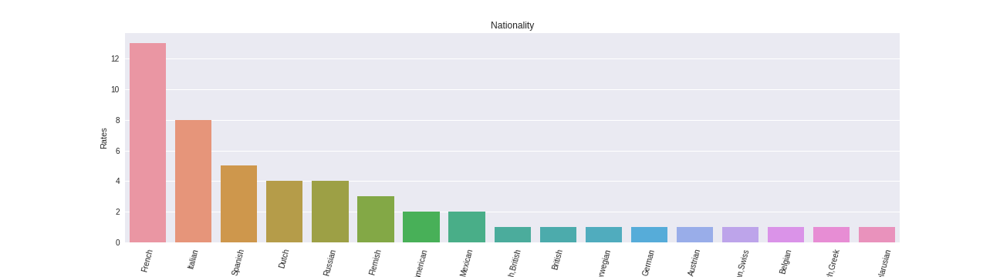
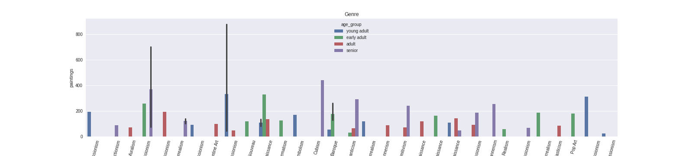
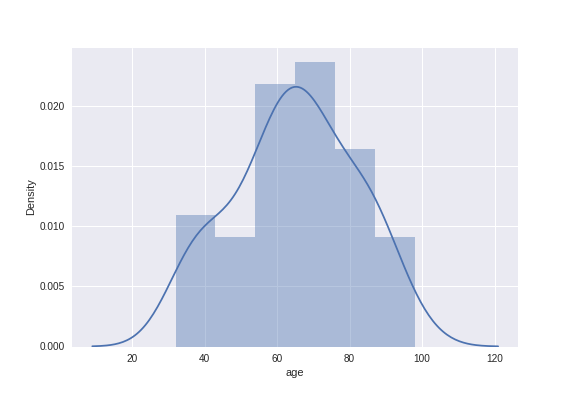
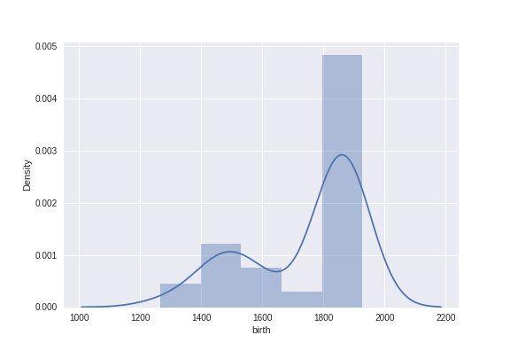

# Best-Artworks-of-All-Time
<h1>About</h1>

A collection of artworks of the 50 most influential artists of all time.
  You can find the dataset <a href='https://www.kaggle.com/ikarus777/best-artworks-of-all-time'>here</a>

<h3>1. Visualization</h3>
<h4>Resized artworks</h4>

<h4>Nationality of artists</h4>

<h4>Genre against frequency of artworks on Age Groups</h4>

<h4>KDE Plots</h4>

  
  

